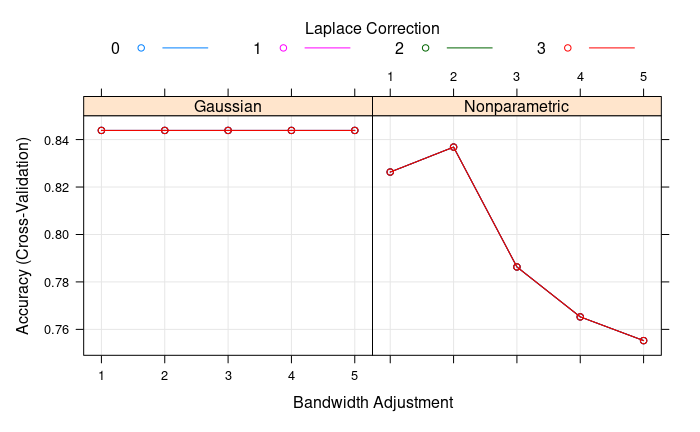

[**Supervised** (non-linear) **classification method**]

Naive Bayes is a probabilistic classifier based on i) **Bayes' theorem** and 
ii) a strong ("**Naive**") **assumption** on the **independence of all $$p$$ features** (variables) within each class.

### Naive Bayes: the gist of it

- resource efficient & fast
- scales well
- works well when the number of samples $$n$$ is small relative to the number of features $$p$$

