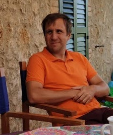

Filippo Biscarini, Ph.D.
**Biostatistician** @ CNR
*Bioinformatics, biostatistics, genomics, machine learning, deep learning*

>National Research Council (CNR)  
>Institute for Biology and Biotechnology
>Via A. Corti n. 12, 20133 Milan (Italy)

- filippo.biscarini [at] cnr.it
- my [ResearchGate](https://www.researchgate.net/profile/Filippo-Biscarini-2)
- my [Google Scholar](https://scholar.google.it/citations?user=aaBX3kcAAAAJ&hl=en)
- my [Scopus](https://www.scopus.com/authid/detail.uri?authorId=25640857200)
- my [institutional CNR page](https://ibba.cnr.it/staff/filippo-biscarini/)
- my [Github](https://github.com/filippob/)

### Research summary
My research activities span from plant and animal breeding & genetics, to bioinformatics and biostatistics applications in plant & animal science and human medicine. 
I worked for the breeding industry, for universities and research centres and for international organizations in many places: 
Italy, Ireland, Canada, The Netherlands, Germany, Spain, Madagascar, The United Kingdom, Belgium.
I am now Senior Scientist at CNR. Currently, I have rejoined my research group in Milan after being seconded for two years at the Data Analysis Team of the ERC (European Research Council).
Current projects include: deep neural network models for image, sound, text and tabular data in (semi)supervised and unsupervised problems; machine learning methods for the prediction of GHG (greenhouse gas) emissions from dairy farms; measuring the accuracy of imputing missing genetic variants in diploid genomes under challenging scenarios; using environmental descriptors ("enviromics") to model GxE (genotype by environment) interactions in genomic predictions; GWAS for survival to covid-19 in a large integrated heterogeneous dataset; developing methods and tools to detect and interpret runs of homozygosity (ROH) and heterozygosity-rich regions (HRR) in diploid genomes.

#### Research topics

- Statistics, machine and deep learning: explore the boundaries of predictions
- GHG emissions from agriculture: tools for predictions and monitoring emissions, strategies for reduction and mitigation
- Imputation of missing data: methods, accuracy and scenarios for the imputation of any type of missing data (not only genotypes!)
- Computer vision: methods and applications in agriculture and medicine
- Biomarkers discovery and precision medicine
- The role of microbiome in animals, plants, humans, food and environments
- Antimicrobial resistance in farm animals: approaches to reduce or replace the use of antimicrobials in farm animals
- Genotype-by-environment interactions in plant and animal breeding: more accurate and robust predictions, adaptation of populations to changing climate and environments
- GWAS: methods and applications
- Genomics: structure, distribution and practical applications of homozygous and heterozygos regions in diploid genomes (ROH, HRR)
- Plant and animal breeding: increase yield, sustainability and production efficiency in farm animals and crops (any ploidy)

#### Dissemination

- founding member of The Bioinformateachers
- teacher at Physalia courses (freie Universit&auml;t Berlin):
	- [since 2018] Introduction to GWAS
	- [since 2020] Introduction to Machine Learning  
	- [since 2020] Introduction to Deep Learning
	- [since 2023] Analysis of longitudinal data
- teacher at the University of Pisa:
	- [2022-2024] Animal breeding and genetics
- teacher at the Universities of Parma, Bari:
	- [2023-2024] Introduction to Neural Netowrks for animal science
- teacher at the University of Catania:
	- [2013] Molecular microbiology and statistical epidemiology
- assistant teacher at Wageningen University:
	- [2009] Animal breeding and genetics

#### Research positions

- [since 2025] Director of Research at [CNR](https://www.cnr.it/en) (National Research Council, Milan, Italy)
- [2018-2025] Senior Scientist at [CNR](https://www.cnr.it/en) (National Research Council, Milan, Italy)
- [2018-2020] Seconded National Expert on Data Science at [ERCEA](https://erc.europa.eu/about-erc/erc-executive-agency) (European Research Council Ex. Agency, Bruxelles, Belgium)
- [2017-2018] Marie-Curie Senior Biostatistician, Cardiff University ([School of Medicine](https://www.cardiff.ac.uk/medicine)) (Cardiff, United Kingdom)
- [2016-2018] Tenured Scientist at [CNR](https://www.cnr.it/en) (National Research Council, Milan, Italy)
- [Feb 2017] [UN-IAEA](https://www.iaea.org/) Expert Mission, Centre national de la recherche appliquée au développement rural (Antananarivo, Madagascar)
- [2016] Researcher at the School of Biosciences, [University of Teramo](https://www.unite.it/UniTE/) (Italy)
- [2014-2016] Principal Investigator at [PTP Science Park](https://www.ptp.it/en/homepage) (Lodi, Italy)
- [Oct 2016] COST Short-Term Scientific Mission, [IRTA](https://www.irta.cat/es/) (Institut de Recerca i Tecnologia Agroalimentàries) (Caldes de Montbui, Spain)
- [2011-2014] Marie-Curie post-doctoral researcher at [PTP Science Park](https://www.ptp.it/en/homepage) (Lodi, Italy)
- [Mar 2013] ESF Visiting Scientist, Cardiff University ([School of Biosciences](https://www.cardiff.ac.uk/biosciences)) (Cardiff, UK)
- [2010-2011] Post-doctoral researcher (Wissenschaftlicher Mitarbeiter), [Georg-August Universit&auml;t](https://www.uni-goettingen.de/) (G&ouml;ttingen, Germany)
- [2006-2010] Marie-Curie Phd fellow, [Wageningen University](https://www.wur.nl/) (Wageningen, The Netherlands)
- [2003-2006] Quantitative Geneticist at the R\&D office of the  Italian Holstein Association ([ANAFIBJ](http://www.anafi.it/)) (Cremona, Italy)
- [2005] Visiting scientist at the Centre for Genetic Improvement of Livestock ([CGIL](https://cgil.uoguelph.ca/)), University of Guelph (Guelph, Canada)
- [2002] Data analyst and programmer at [ICBF](https://www.icbf.com/) (Irish Cattle Breeders Federation) (Cork, Ireland)

#### Alumni

Very smart people who I had the honor of mentoring:

- [Nicol Sartori](https://www.linkedin.com/in/nicolsartori/?originalSubdomain=it) (2025 - ongoing)
- [Mahsa Dehnavi](https://scholar.google.com/citations?user=1tShe7cAAAAJ&hl=en) (2025 - ongoing)
- [Giulia Moscatelli](https://www.researchgate.net/profile/Giulia-Moscatelli) (2024 - ongoing)
- [Luiz Gustavo De Matos](https://www.linkedin.com/in/luiz-gustavo-de-matos-403032158/?originalSubdomain=br) (2024 - 2025)
- [Delower Hossain](https://dottorati.unimi.it/vas/faculty/hossain-delower/) (2024 - ongoing)
- [Tania Bobbo](https://www.researchgate.net/profile/Tania-Bobbo) (2022 - ongoing)
- [Arianna Manunza](https://ibba.cnr.it/staff/arianna-manunza/) (2022 - ongoing)
- [Johanna Ramírez Díaz](https://ibba.cnr.it/staff/johanna-ramirez-diaz/) (2022 - ongoing)
- [Chiara Gini](https://www.researchgate.net/profile/Chiara-Gini) (2021 - 2024)
- [Chiara Broccanello](https://www.dbt.univr.it/?ent=persona&id=72613) (2013 - 2023)
- [Giorgio Chessari](https://www.di3a.unict.it/dottorandi/giorgio.chessari) (2022 - 2025)
- [Rafaela Martins Morasi](https://www.researchgate.net/profile/Rafaela-Morasi) (2023 - 2024)
- [Giulia Masetti](https://www.researchgate.net/profile/Giulia-Masetti-2) (2015 - 2023)
- [Xavier Zaoui](https://www.linkedin.com/in/xavier-k-zaoui/?originalSubdomain=it) (2020)
- [Eva-Maria Pirker](https://blest.unibocconi.eu/who-we-are/phd-students/eva-maria-pirker) (2019)
- [Daniel Pitt](https://orcid.org/0000-0002-8429-2957) (2016 - 2020)
- [Jody Leigh Edmunds](https://www.researchgate.net/profile/Jody-Edmunds-2) (2017 - 2022)
- [Silvia Sandrini](https://www.unimi.it/it/ugov/person/silvia-sandrini) (2022 - 2024)
- [Laura Filippone Pavesi](https://www.ospedaleveterinario.unimi.it/staff/laura-filippone-pavesi-clinica-dei-ruminanti-e-del-suino/) (2022 - 2023)
- [Mona Hashemi](https://www.researchgate.net/profile/Mona-Hashemi-2) (2017 - 2018)
- [Sowah Addo](https://www.researchgate.net/profile/Sowah-Addo) (2009 - 2010)
- Michael Kramer (2010 - 2011)
- [Farhad Vahidi](https://www.researchgate.net/profile/Sm-Farhad-Vahidi) (2010 - 2011)

#### Education

- [2025] Habilitation as Full Professor in Plant Breeding and Genetics
- [2018] Habilitation as Associate and Full Professor in Animal Breeding and Genetics; Habilitation as Associate Professor in Plant Breeding and Genetics
- [2006-2010] Doctor of Philosophy in Animal Breeding and Genomics (Wageningen University, The Netherlands)
- [1996-2002] Master of Science in Veterinary Medicine (University of Perugia)
- [1999] Erasmus Programme - Veterinary Epidemiology and Food Safety (Utrecht University, The Netherlands)

#### Projects

- 2025-2026: **PROB-AI**: Identifying novel probiotics from sequence data by means of artificial intelligence algorithms - [CNR-DISBA 2024 call for projects](https://www.urp.cnr.it/node/14158) (**probiotics**, **machine learning**, **bacterial genomic sequences**; **Principal Investigator**)
- 2023-2026: **Polyploidbreeding 4.0**: Expanding the toolbox for cereal breeding: high-throughput genomics, 2D-3D phenomics and artificial intelligence for breeding with increasing genome complexity, from barley to durum and bread wheat - [PRIN 2022](https://prin.mur.gov.it/Iniziative/Detail?key=FiJNdaCuA71Xq3jYMAuZeQ%3D%3D). (**plant breeding: genomics, phenomics, neural networks, machine learning**; **Scientific coordinator**; G.A.: 2022BACN8A; [website](https://polyploidbreeding.ibba.cnr.it/))
- 2025: **To impute or not impute, a problem of missing data**: joint project with the School of Biosciences at Cardiff University (UK) - [STM (Short-term Mobility) 2025](https://www.cnr.it/sites/default/files/public/upload/2025/06/09/Provvedimento_graduatoria_DISBA_2025_signed_prot_204618_06_06_2025.pdf) (**imputation**, **missing genotypes**, **software development**; **Principal Investigator**)
- 2024-2025: **DeepMicroCore**: Harnessing the power of artificial intelligence to identify the core microbiome - [CNR-IVI bilateral agreement](https://www.cnr.it/en/bilateral-agreements/agreement/85/ivi-the-institute-for-artificial-intelligence-research-and-development-of-serbia) (**artificial intelligence**, **neural networks**, **core microbiome**; **Principal Investigator**; Project ID: 69001)
- 2024-2025: **Sheep-TreeSeq**: Scalable analysis of sheep genome diversity using tree sequences - [Royal Society - International Exchanges](https://royalsociety.org/grants/international-exchanges/) (**graph algorithms, animal genomics**; **Principal Investigator**; Ref.: R3709)
- 2023-2026: **MISS.GO**: Microbiota and Immune SignatureS of Graves’ disease and Orbitopathy - [PRIN 2022](https://prin.mur.gov.it/Ricerca?Filtro.Anno=%25&Filtro.Ateneo=%25&Filtro.Argomento=&Filtro.Cognome=Muller) (**Graves disease**, **orbitopathy**, **gut microbiome**, **gut-immune system axis**; **Task Leader: Microbiome**)
- 2024-2029: **Breast cancer and thyroid autoimmunity**: Cross-reactive immune responses between breast cancer and thyroid autoimmunity: impact on prognosis and treatment - [AIRC-MFAG 2023](https://www.airc.it/fondazione/cosa-facciamo/cosa-finanziamo/my-first-airc-grant) (**breast cancer**, **endocrinology**, **gut microbiome**; **Task Leader: Microbiome**)
- 2021-2024: **GENOBU**: Sequencing the buffalo genome for the genetic improvement of production - [PON01 00486](https://www.cnr.it/it/progetti-di-ricerca/progetto/31396/genobu-sequenziamento-del-genoma-bufalino-per-il-miglioramento-qualiquantitativo-delle-produzioni-agro-alimentari-dba-ad004-178) (**buffalo**, **genomic predictions**; **Task Leader: Genomics**)
- 2020-2023: **Gen-COVID**: Impact of Host Genome on COVID-19 clinical variability. (**human genetics, clinical phenotypes**; **Principal Investigator**; [website](https://sites.google.com/dbm.unisi.it/gen-covid))
- 2019-2023: **Freeclimb**: Fruit Crops Resilience to Climate Change in the Mediterranean Basin - [EU-PRIMA 2018](https://prima-med.org/). (**plant breeding: genomics, phenomics**; **Principal Investigator**; G.A.: 1813-2; [website](https://primafreeclimb.com/project/))
- 2018-2023: **SMARTER**: SMAll RuminanTs breeding for Efficiency and Resilience - [EU Horizon2020](https://research-and-innovation.ec.europa.eu/funding/funding-opportunities/funding-programmes-and-open-calls/horizon-2020_en). (**animal genomics and phenomics**; **team member**; G.A.: 772787; [website](https://smarterproject.eu/))
- 2018-2021: **FARM-INN**: FARM-level interventions supporting industry INNovation - [AGER](https://progettoager.it/). (**animal and food microbiome**; **Task Leader Microbiome**; G.A.: 2017-1130; [website](https://www.ispaam.cnr.it/english-farm-inn/?lang=en))
- 2018-2021: **RABOLA**: Sustainable strategies to reduce the use of antibiotics in dairy cattle farming - [Regione Lombardia, Call 2018 ddsn 4403](https://www.regione.lombardia.it/wps/wcm/connect/e9a02307-8353-4818-9f6a-2e8597b7fc92/Scheda+iniziale+5+RABOLA.pdf?MOD=AJPERES&CACHEID=e9a02307-8353-4818-9f6a-2e8597b7fc92). (**animal and food microbiome, antimicrobial resistance**; **Task Leader Microbiome**; G.A.: d.d.s. 19442/2018; [website](https://sites.unimi.it/rabola/))
- 2018-2019: **TT AgriLab**: Technology Transfer for SMEs in the AgriFood industry - [Assolombarda - TTAgriLab](https://www.assolombarda.it/servizi/industria-innovazione-e-qualita/informazioni/manifestazione-dinteresse-e-progetto-tt-agrilab). (**knowledge and technology transfer**; **Scientific Expert**; Ref.: 2017/0001874)
- 2016-2017: **LegPipe**: Legumes GBS Pipeline Exploration - [CINECA](https://www.cineca.it/en). (**computational infrastructure, bioinformatics pipelines**; **team member**; Ref.: HPL13D6NFZ)
- 2015-2018: **Climgen**: Climate genomics for animal adaptation - [FACCE ERANET+](https://www.era-learn.eu/network-information/networks/facce-era-net-plus). (**animal genomics, climate change**; **WP co-leader**; G.A.: ANR-14-JFAC-0002-01; [website](https://project-wheel.faccejpi.net/climgen/))
- 2014-2018: **INDIGO**: Investigation of Novel biomarkers and Definition of the role of the microbiome In Graves' Orbitopathy - [EU-FP7](https://cordis.europa.eu/programme/id/FP7). (**human microbiome, transcriptomics, miRNA, proteomics, metabolomics, biostatistics**; **Principal Investigator**; G.A.: 612116; [website](https://cordis.europa.eu/project/id/612116))
- 2013-2017: **Fecund**: Optimisation of early reproductive success in dairy cattle through the definition of new trait and improved reproductive biotechnology - [EU-FP7](https://cordis.europa.eu/programme/id/FP7). (**animal genetics, multiomics, biostatistics**; **Scientific Coordinator**; G.A.: 312097; [website](https://cordis.europa.eu/project/id/312097))
- 2013-2017: **Methagene**: Large-scale methane measurements on individual ruminants for genetic evaluations - [COST Action](https://www.cost.eu/) (**climate change, animal farming, biostatistics**; **WG co-leader**; G.A.: COST FA1302; [website](https://www.methagene.eu))
- 2013: **ESF Exchange Grant**: Detection of selection signatures of domestication in ancestral and domestic goats (at Cardiff University, School of Biosciences, UK) - [ESF exchange grants](http://archives.esf.org/coordinating-research/research-networking-programmes/biomedical-sciences-med/current-esf-research-networking-programmes/translational-research-on-antimicrobial-resistance-and-community-acquired-infections-in-europe-trace/exchange-grants.html) (**animal genomics, evolution**; **grantee**; Ref.: 4103, 22/12/2012)
- 2012-2015: **Gene2Farm**: Next generation European system for cattle improvement and management - [EU-FP7](https://cordis.europa.eu/programme/id/FP7). (**animal breeding: genomics, phenomics**; **team member**; G.A.: 289592; [website](https://cordis.europa.eu/project/id/289592))
- 2012-2015: **RuminOmics**: Connecting the animal genome, gastrointestinal microbiomes and nutrition to improve digestion efficiency and the environmental impacts of ruminant livestock production - [EU-FP7](https://cordis.europa.eu/programme/id/FP7). (**animal microbiome, genomics, nutrition**; **team member**; G.A.: 289319; [website](https://cordis.europa.eu/project/id/289319))
- 2011-2014: **Neutradapt**: Estimating genetic variation in farm animals - [Marie-Curie ERG](https://cordis.europa.eu/programme/id/FP6_MOBILITY-4.1). (**animal genomics, biodiversity, biostatistics**; **Principal Investigator member**; G.A.: 276699; [website](https://cordis.europa.eu/article/id/182855-estimating-genetic-variation-in-farm-animals))
- 2010-2014: **Nextgen**: Next generation methods to preserve farm animal biodiversity by optimizing present and future breeding options - [EU-FP7](https://cordis.europa.eu/programme/id/FP7). (**animal genomics, biodiversity, population genetics**; **team member**; G.A.: 244356; [website](https://cordis.europa.eu/project/id/244356))
- 2010-2014: **Low-input breeds**: Development of integrated livestock breeding and management strategies to improve animal health, product quality and performance in European organic and 'low input' milk, meat and egg production - [EU-FP7](https://cordis.europa.eu/programme/id/FP7). (**animal breeding: genetics, management, organic agriculture**; **team member**; G.A.: 222623; [website](https://cordis.europa.eu/project/id/222623))
- 2006-2010: **Robustness in laying hens** - National Dutch project for the genetic improvement of laying hens better able to cope with changing farming environment (**animal breeding: genetics, statistics**; **Task leader statistical genetics**)

#### Invited speeches

- 29/10/2025: ``Machine Learning applications in research related to agriculture and food science'', International Research Conference of the SLTC 2025 (IRC-SLTC 2025: https://irc.sltc.ac.lk/), Padukka (Sri Lanka) (webinar)
- 22/11/2024: key note on ``Computer vision for plant phenotyping: the Polyploidbreeding 4.0 project and the AGRI-VISION initiative'', Nordic-Baltic Plant Phenotyping Network (NBPPN) Workshop, Båstad (Sweden)
- 06/09/2018: ``Omic' approaches to identifying biomarkers in GO'' at the Cambridge Ophthalmological Symposium 2018, University of Cambridge (UK)
- 30/10/2016: "The application of bioinformatics and biostatistics to dairy cattle fertility" at ESDAR (European Society for Domestic Animal Reproduction) 2016 Satellite Workshop, Lisbon (Portugal)

#### Thesis supervision

- 27/09/2024: Member of **Doctoral Thesis Defense Committee**, PhD in Animal Production Science and Technology. "New insights for enhancing feed efficiency" by Mónica Mora Fenoll. Universitat Politécnica de València (Spain)

#### Awards

- 12-13/11/2025: Best Presenter Award for the presentation ``PROB-AI: Identification of new probiotics from bacterial genomic sequences using machine learning algorithms'' - $$5^{th}$$ International Research Conference 2025 ([IRC 2025](https://irc.sltc.ac.lk/)), Sri Lanka Technology Campus
- 07/09/2023: Premio per l'originalità e la validità scientifica della ricerca - 7° Congresso AITEL 2023 (award for best presentation) - AITel (Italian Dairy Association)
- 16/12/2021: Premi per le migliori pubblicazioni DiSBA 2021: I frutti dell'eccellenza (award for best publication) – CNR (National Research Council) Award for the publication "Genetic mechanisms of critical illness in COVID-19" (Nature volume 591, pages92–98 (2021))
- 07/12/2018: Premi per le migliori pubblicazioni DiSBA 2018: I frutti dell'eccellenza (award for best publication) – CNR (National Research Council) Award for the publication "Convergent genomic signatures of domestication in sheep and goats" (Nature Communications volume 9, Article number: 813 (2018))
- 25/11/2015: Premio Lombardy Dialogues: progetto spazi espositivi per la ricerca - EXPO 2015 (award for best publication) – CNR (National Research Council) Award forthe publication "Predicting haplotype carriers from SNP genotypes in Bos taurus through linear discriminant analysis" (Genetics Selection Evolution volume 47, Article number: 4 (2015))

#### Editor at

- [Frontiers in Genetics](https://www.frontiersin.org/journals/genetics?utm_source=google&utm_medium=paidsearch&utm_content&utm_campaign=jsub_jnlprom_08-25_fgene_en_nat_fois-reg13&gad_source=1&gad_campaignid=22872736684&gbraid=0AAAAAC_sJ7lp2wBJo8NsbIlsbaRLWcJ0g&gclid=CjwKCAjwtrXFBhBiEiwAEKen13numnS9UP_Y4V9BjmXRU8ouHn8COQUFlyceGXuJYrgpoVAu8kmRnRoCdhEQAvD_BwE)
- [Frontiers in Endocrinology](https://www.frontiersin.org/journals/endocrinology?utm_source=google&utm_medium=paidsearch&utm_content&utm_campaign=jsub_jnlprom_08-25_fendo_en_nat_fois-reg13&gad_source=1&gad_campaignid=22893123552&gbraid=0AAAAAC_sJ7mY4WIxjaGJU4OBjRcvaqghR&gclid=CjwKCAjwtrXFBhBiEiwAEKen10_H-eY6qaeRtG5C0_FoIRUPZipyriL6ubHATU5x2XMcgEBvz1tSDRoCZtsQAvD_BwE)
- [BMC Genomic Data](https://bmcgenomdata.biomedcentral.com/)
- [BMC Hereditas](https://hereditasjournal.biomedcentral.com/)

#### Hobbies

Bridge, Waterpolo, Guitar, Mystery Novels

