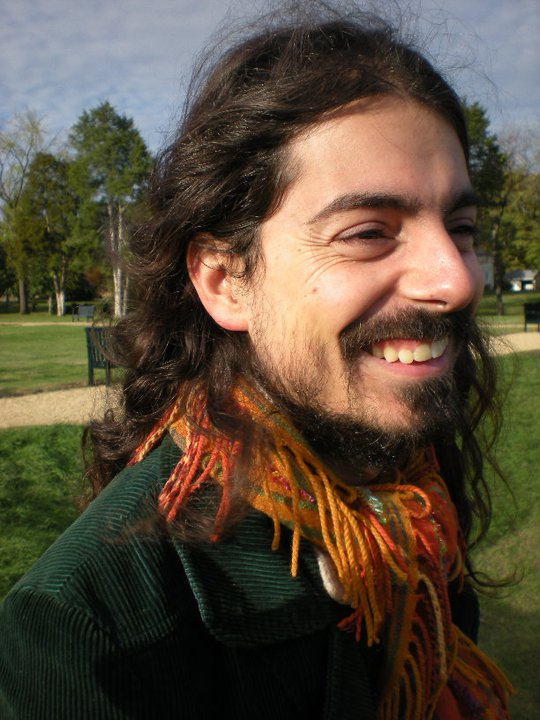

**Nelson Nazzicari**, Ph.D.  
*Bioinformatics, genomic predictions, machine/deep learning, SNP calling, all things biomodeling*

Tenured Scientist @ 
CREA - Council for Agricultural Research and Analysis of Agricultural Economics  
Research Centre for Animal Production and Aquaculture 
Viale Piacenza, 29 - 26900 Lodi, Italy

- nelson.nazzicari [at] crea.gov.it
- my [ResearchGate](https://www.researchgate.net/profile/Nelson-Nazzicari)
- my [Google Scholar](https://scholar.google.it/citations?user=i2dlVhgAAAAJ&hl=en)
- my [institutional CREA/Genleg page](https://genleg.crea.gov.it/index.php/2022/02/14/nelson-nazzicari/)

### Research topics

* Statistics and machine learning for inference and prediction
* Genomics & co: population structure, genomic selection, association and diversity studies, metagenomics
* Next Generation Sequencing: variant calling and related topics

### Dissemination

* founding member of The Bioinformateachers :)
* member of [Comintart](https://www.youtube.com/channel/UCMgjppN-5w5OAt67o2jzK7w) (Italian Committee for Artificial Intellingence)
* teacher at Physalia school in Berlin:
	* [since 2020] [Introduction to Deep Learning](https://www.physalia-courses.org/courses-workshops/course67/)
	* [since 2022] [Data visualization in Python](https://www.physalia-courses.org/courses-workshops/course38/)
* webmaster, Social Media Manager and member of [The international Legume Society](http://legumesociety.org/)
* affiliated to the [Centre of Excellence for Biodiversity and Molecular Plant Breeding](http://biodiv.iptpo.hr/?page_id=1261&lang=hr) based in Zagreb, Croatia

### Research positions

* [since Nov 2019] Scientist (then tenured scientist) at CREA
	* started working at CREA in September 2014 as a post doc
* [Jan 2013 – Aug 2015] Hired scientist/statistician at [PTP – Parco Tecnologico Padano](https://www.ptp.it/), Lodi, Italy
* [Oct 2011 – Jan 2013] Post doc and contracted professor at University of Pavia, Italy, Faculty of Engineering
	* Professor for the course: “Fondamenti di informatica B, (Modulo di Fondamenti di Informatica) ING-INF/05”, focused on C programming
* [Aug 2009 – Sept 2011] Research scholar at George Mason University, [Center for Secure Information Systems](http://csis.gmu.edu/), Fairfax, Virginia, USA

### Alumni 

Very smart people which I had the honor of mentoring:

* [Harkingto Harkingto](https://photosyntech.no/people/harkingto-harkingto/) (2023-ongoing)
* [Margherita Crosta](https://genleg.crea.gov.it/index.php/2022/02/14/margherita-crosta) (2021 – ongoing)
* [Salvador Osuna Caballero](https://www.researchgate.net/profile/Salvador-Osuna-Caballero) (2022)
* [Verónica Vanesa Ergo](https://ri.conicet.gov.ar/author/61170) (2021)
* [Zoe Andrijanić](https://www.researchgate.net/profile/Zoe-Andrijanic) (2021)
* [Chahira Achir](https://www.researchgate.net/profile/Chahira-Achir) (2018)
* [Cristina Monterrubio Martin](https://es.linkedin.com/in/cristina-monterrubio-mart%C3%ADn-4329571ba/) (2018)
* [Tommaso Bardelli](https://www.researchgate.net/profile/Tommaso-Bardelli) (2018)

### Education

* [2005-2008] Doctor of Philosophy in Informatics and Electrics Engineering
* [2003-2005] Master of Science (Informatics Engineering), cum Laude
* [2000-2003] Bachelor of Science (Informatics Engineering), cum Laude

